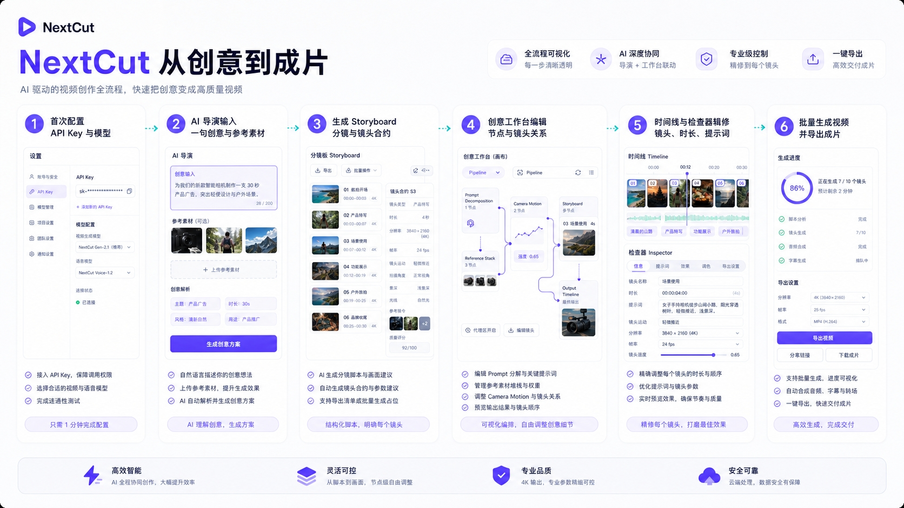
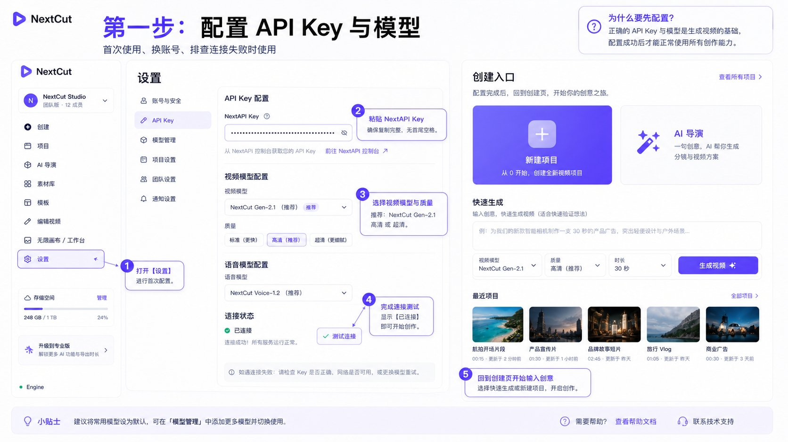
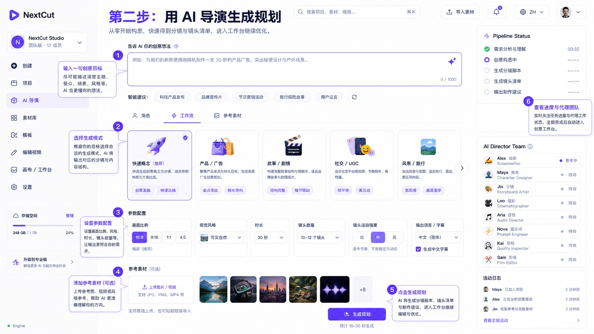
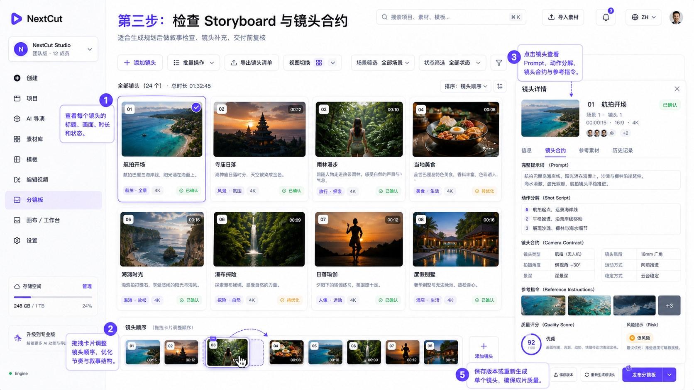
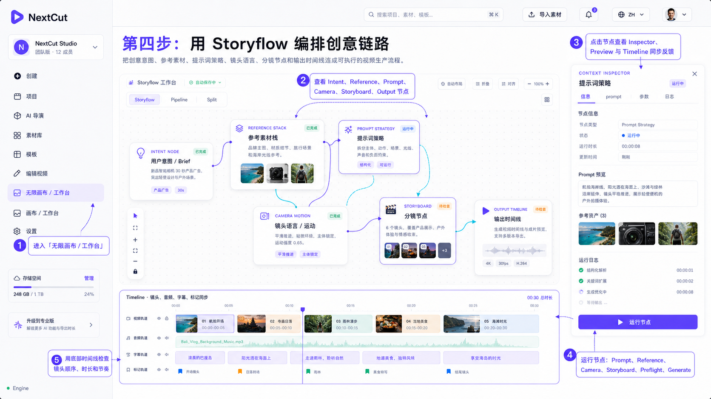
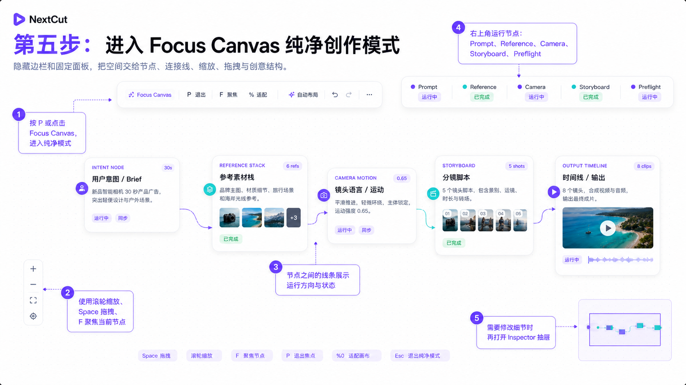
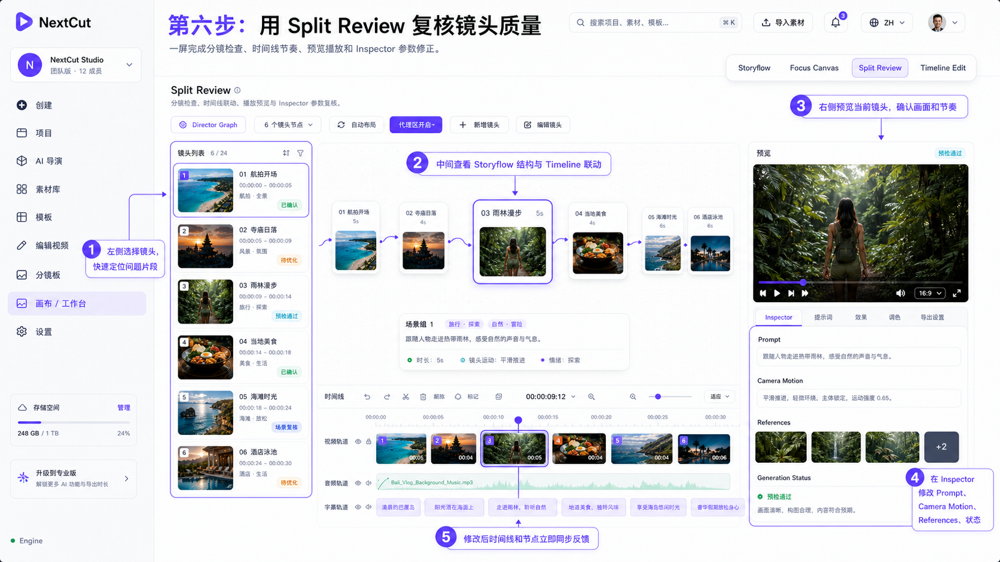
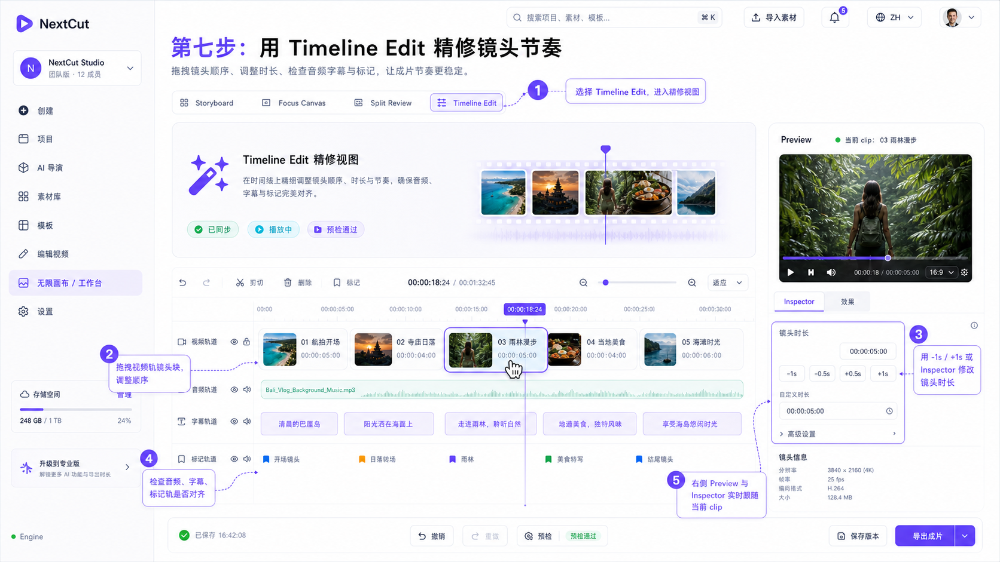
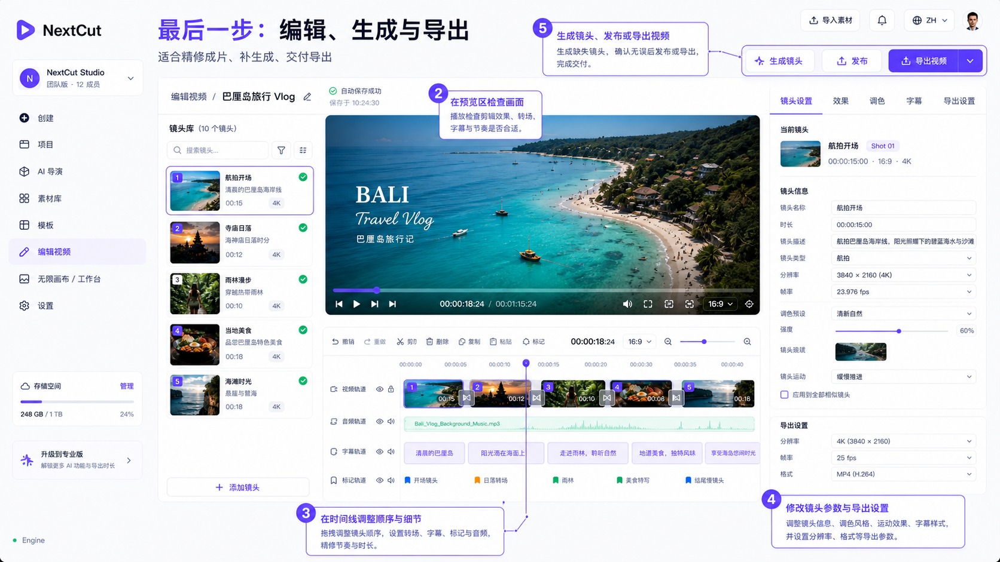

# NextCut Product Guide

## Purpose

Document the in-app user guide for NextCut: how a creator moves from setup to AI planning, storyboard review, workbench refinement, editing, generation, and export.

## Invariants

- The guide must live inside the app, not only in repository docs.
- Each major product area should explain when to use it and how to use it.
- Images used by the app are stored in `apps/nextcut/public/tutorial/`.
- Mirrored documentation images are stored in `docs/assets/nextcut-workbench/`.
- The guide must not imply that a feature is fully backend-connected unless the corresponding UI action calls an implemented route.

## Public Surface

- Sidebar page: `guide`
- Frontend component: `apps/nextcut/src/components/panels/GuidePanel.tsx`
- App route state: `SidebarPage = "guide"`
- Sidebar label keys: `nav.guide`
- Public image URLs:
  - `/brand/nextcut-logo-lockup.png`
  - `/brand/nextcut-logo-lockup-sidebar.png`
  - `/brand/nextcut-logo-icon.png`
  - `/tutorial/product-overview.jpg`
  - `/tutorial/client-shell-guide.png`
  - `/tutorial/library-real-assets-guide.png`
  - `/tutorial/provider-registry-guide.png`
  - `/tutorial/setup-guide.jpg`
  - `/tutorial/director-guide.jpg`
  - `/tutorial/storyboard-guide.jpg`
  - `/tutorial/workbench-normal.png`
  - `/tutorial/workbench-clean.png`
  - `/tutorial/workbench-split.png`
  - `/tutorial/workbench-timeline.png`
  - `/tutorial/editor-export-guide.png`

## User Flow

1. Configure the API key and model settings.
2. Use AI Director to turn one creative brief into a plan.
3. Review the storyboard and shot contracts.
4. Use the creative workbench for prompt decomposition, references, camera motion, storyboard structure, and output planning.
5. Refine the timeline, shot settings, captions, and export options.
6. Generate or regenerate shots, then export the final video.

## Infinite Canvas / Storyflow Workbench

The current `workspace` page is the Storyflow workbench, not the old generic canvas. It is documented in detail in `docs/modules/nextcut-storyflow-workbench.md`.

Current implemented modes:

- Storyflow: default global structure view with node canvas, scene outline, node library, production run dock, overlay inspector, and mini timeline.
- Focus Canvas: pure mode. It hides the app sidebar through `workspaceCleanMode`, keeps floating controls, and lets the canvas become the main surface.
- Split Review: left shot rail, center canvas and timeline, right preview and inspector for review loops.
- Timeline Edit: large timeline execution view with preview and inspector.

Current real interactions:

- Node selection, timeline selection, preview, and inspector share the same `selectedShotId`.
- Prompt Decomposition writes structured prompt fields into the selected shot.
- Reference Stack writes image/video/audio URLs into `shot.generationParams`.
- Camera Motion writes the camera contract into `shot.camera` and `motion_desc`.
- Storyboard Keyframes calls `/agents/generate-storyboard-assets` and writes storyboard, first-frame, and last-frame URLs back to the shot when the sidecar route returns assets.
- Preflight builds the generation payload and blocks invalid generation before submit.
- Generate Shot submits `/generate/submit` after preflight.
- Timeline drag/drop reorders shots; duration edits update the shared shot state.

Current boundaries:

- The Version node and some inspector quick actions are UI scaffolding until version/rollback APIs are implemented.
- Custom graph connections are interactive but not yet saved as a durable graph model.
- Character three-view / expression / outfit / pose asset chains need first-class APIs before the product can claim full identity-lock production.

## Brand And Client Shell

Current shell decisions:

- The sidebar brand uses the generated NextCut lockup crop from `apps/nextcut/public/brand/nextcut-logo-lockup-sidebar.png`.
- The larger documentation/brand preview is `apps/nextcut/public/brand/nextcut-logo-lockup.png`.
- Collapsed sidebar uses the matching icon crop at `apps/nextcut/public/brand/nextcut-logo-icon.png`.
- The previous fake team card has been replaced by a real local-workspace menu.
- The workspace menu opens Settings or Projects; it must not claim team members or plan tiers that are not backed by data.
- The Tauri client has its own lightweight titlebar and window controls. The app window is resizable, maximizable, and starts maximized in dev.
- The top import action opens the OS file picker and routes selected files into the Library page.

Data boundary:

- Library should only show local imported files or AI Director / generation outputs.
- Demo assets must not be injected as fallback data.
- Empty states should explain the next action instead of pretending content exists.
- Engineering/design-system notes must stay in docs, not in product-facing subtitles.

## Updated Functional Guide Images

### Client Shell

The client shell guide image reflects the current direction for:

- compact brand placement;
- local workspace menu instead of fake team state;
- searchable top bar;
- import action;
- provider/status visibility.

### Media Library

The library guide image documents the current data boundary:

- local imported files;
- AI-generated shot assets;
- selected asset inspector;
- explicit empty state;
- no demo fallback data.

### Provider Registry And Prompts

The settings guide image documents the configurable production surface:

- Seedance, NextAPI, ComfyUI, RunningHub, local OpenAI-compatible, and custom HTTP adapters;
- unified response envelope;
- editable Base URL, model, and API key fields;
- prompt template editor;
- test connection and save actions.

## Page-by-page Usage

### Setup

Use when launching for the first time, changing accounts, or debugging failed generation requests.

Steps:
- Open Settings.
- Paste the NextAPI key.
- Choose video model, quality, base URL, and generation options.
- Return to Create or AI Director once the connection is ready.

### AI Director

Use when starting from a blank idea or when a team needs an initial storyboard and shot plan quickly.

Steps:
- Write the creative goal in the main prompt box.
- Choose workflow mode and parameters.
- Add reference assets if available.
- Generate the plan and monitor pipeline progress.

### Storyboard

Use after AI Director has produced a draft plan.

Steps:
- Review each shot title, thumbnail, duration, status, and quality notes.
- Drag cards to adjust order.
- Inspect prompt, action decomposition, camera contract, and reference instructions.
- Regenerate or revise only the shots that need work.

### Workbench Normal Mode

Use when a creator needs full Storyflow context: intent, prompt strategy, reference stack, camera motion, scene groups, shot nodes, output, inspector, preview, and timeline.

Steps:
- Enter Workspace.
- Keep the mode on Storyflow.
- Select nodes to synchronize canvas, inspector, preview, and timeline.
- Use the node run dock to apply Prompt Decomposition, Reference Stack, Camera Motion, Storyboard Keyframes, Preflight, or Generate Shot.
- Use the mini timeline to check order and duration without leaving the graph.

### Workbench Clean Mode

Use when the canvas needs focus and the surrounding chrome becomes distracting.

Steps:
- Press `P` or switch to Focus Canvas.
- Work directly on the React Flow canvas with zoom, pan, minimap, node selection, and floating actions.
- Use `F` to focus the selected node and `Cmd/Ctrl+0` to fit the graph.
- Exit clean mode when full navigation is needed again.

### Split Review Mode

Use during review and pre-delivery checks.

Steps:
- Switch to Split Review.
- Select a shot on the left.
- Verify synchronized preview, inspector details, and timeline behavior.
- Fix rhythm, prompt, duration, or status issues before export.

### Timeline Edit Mode

Use when structure is stable and the remaining task is shot order, duration, rhythm, audio, subtitles, and markers.

Steps:
- Switch the workbench mode to Timeline Edit.
- Drag video clips to reorder shots.
- Use zoom controls to inspect pacing.
- Use `-1s` / `+1s` duration controls or the inspector duration field.
- Confirm the selected clip, preview, and inspector stay synchronized.

### Edit and Export

Use when the storyboard is stable and the project is ready for timeline refinement, regeneration, publishing, or export.

Steps:
- Select shots from the shot library.
- Preview video output.
- Adjust timeline order, transitions, captions, and audio.
- Tune shot settings and export options.
- Generate missing shots and export the final video.

## Dependencies

- `apps/nextcut/src/components/ui/kit.tsx`
- `apps/nextcut/src/components/shell/Sidebar.tsx`
- `apps/nextcut/src/components/shell/WorkspaceLayout.tsx`
- `apps/nextcut/src/stores/app-store.ts`
- `apps/nextcut/src/stores/i18n-store.ts`

## Extension Points

- Add new sections to `GUIDE_STEPS` in `GuidePanel.tsx`.
- Add new tutorial images under `apps/nextcut/public/tutorial/`.
- Add matching documentation copies under `docs/assets/nextcut-workbench/`.
- Keep guide CTAs wired to real `SidebarPage` targets.

## Out of Scope

- This guide does not create backend generation capability by itself.
- This guide does not replace API documentation.
- This guide does not claim external integrations are working without executable verification.
