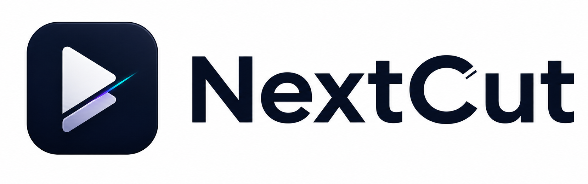
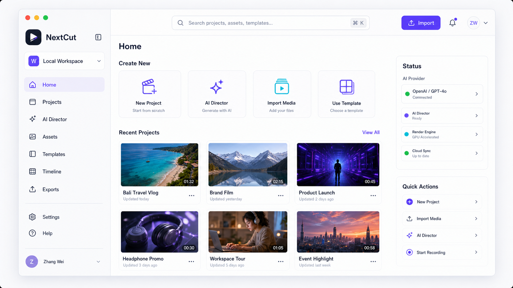
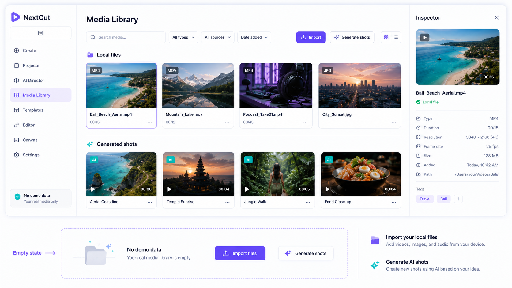
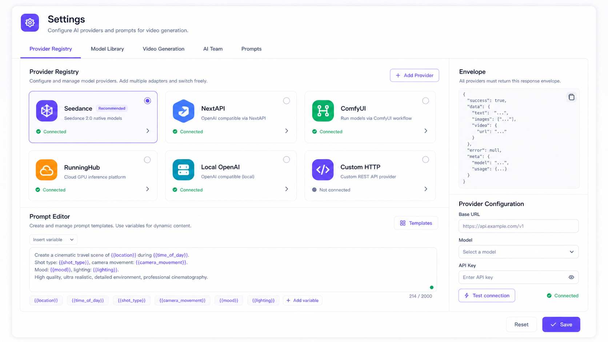

# NextCut 2026-05 Redesign Slice

## Goal
Bring the NextCut desktop UI closer to a modern video-creation SaaS while keeping the current Tauri + React + sidecar architecture. The first validated slice focuses on the AI Director flow because it is the entry point for downstream storyboard, camera motion, prompt review, and edit planning.

## Acceptance Criteria
- Generation controls must affect the produced plan: workflow mode, style, aspect ratio, shot count, duration, motion intensity, knowledge sources, and technique packs.
- The UI must disclose whether a plan came from the sidecar Director engine or the local ViMax-shaped fallback planner.
- The generated plan must populate downstream storyboard/editing state with shots, scenes, characters, shot generation cards, prompt review, quality data, and selected shot.
- Dense controls and cards must use stable sizing, line clamping, and readable spacing so Chinese text does not spill out of cards.
- The desktop shell must not expose fake team, storage, template, or asset data. Empty/product states must map to real actions.
- The sidebar brand must use the current NextCut generated lockup and the collapsed icon crop.

## Source Notes
- `third_party/vimax/nextapi_director.py` exposes the director chain we mirror in product terms: story development, script enhancement, character extraction, storyboard design, visual decomposition, and cinematography refinement.
- `apps/nextcut-sidecar/app/api/director.py` is the real planning endpoint. The UI should try `/director/plan`, poll `/director/plan/{id}`, and only fall back locally when the engine is unavailable.

## 2026-05-08 Shell And Data Cleanup

Brand assets:

- Source generated image is preserved at `apps/nextcut/public/brand/nextcut-logo-lockup-source.png`.
- Documentation/brand preview crop is `apps/nextcut/public/brand/nextcut-logo-lockup.png`.
- Sidebar lockup crop is `apps/nextcut/public/brand/nextcut-logo-lockup-sidebar.png`.
- Collapsed sidebar icon crop is `apps/nextcut/public/brand/nextcut-logo-icon.png`.
- Documentation mirrors live under `docs/assets/nextcut-workbench/`.

Implemented UI corrections:

- `Sidebar.tsx` now uses the generated brand asset instead of the temporary purple play mark.
- The fake `NextCut Studio / 12 成员` team card has been replaced by a local workspace menu with real Settings and Projects targets.
- Fake storage quota and upgrade cards were removed from the sidebar until a real account/billing source backs them.
- `WorkspaceLayout.tsx` top import action opens a file picker and sends selected files to the Library page.
- `LibraryPanel.tsx` no longer injects demo assets when the project is empty. It shows local imports and AI Director / generated shot outputs only.
- Product-facing copy in Home, Projects, Templates, and Settings was cleaned so implementation/design-system notes stay out of the app UI.
- `GuidePanel.tsx` now includes the current brand/client-shell behavior and shows the logo asset in the in-app guide.
- `GuidePanel.tsx` also includes updated image-generated functional guide cards for client shell, media library, and provider registry.

Updated guide images:

Validation:

- `pnpm --filter nextcut typecheck`

## 2026-05-08 Storyflow Workbench Documentation Update

The infinite canvas / workbench changes are now documented separately in `docs/modules/nextcut-storyflow-workbench.md`.

Implemented workbench facts:

- The `workspace` sidebar route renders `StoryflowWorkspace` by default.
- Four modes are backed by `app-store.storyflowMode`: Storyflow, Focus Canvas, Split Review, Timeline Edit.
- Focus mode hides the app sidebar with `workspaceCleanMode`.
- `buildStoryflowGraph` maps AI Director data into intent, prompt, reference, camera, scene, shot, output, review, and version nodes.
- `StoryflowCanvas` uses `@xyflow/react`, minimap, selection, fit view, focus selected, user-created connections, and status-flow edges.
- `StatusFlowEdge` shows selected/running/complete/failed state with animated flow lines.
- `TimelineDock` shares shot selection, reorder, duration, and zoom state with the canvas.
- `InspectorDrawer` is now a collapsible contextual inspector, not a single long form.
- Runnable canvas actions include Prompt Decomposition, Reference Stack, Camera Motion, Storyboard Keyframes, Preflight, and Generate Shot.

Known boundaries:

- Version history and inspector quick actions still need backend command handlers.
- Custom graph connections are not yet persisted.
- Character identity asset chains are not complete until three-view/expression/outfit/pose generation and Identity Lock inheritance APIs are implemented.

Updated product guide:

- `docs/modules/nextcut-product-guide.md` now describes the real Storyflow modes and which node actions are connected.
- `GuidePanel.tsx` should keep application-facing guidance aligned with the current Storyflow implementation.
